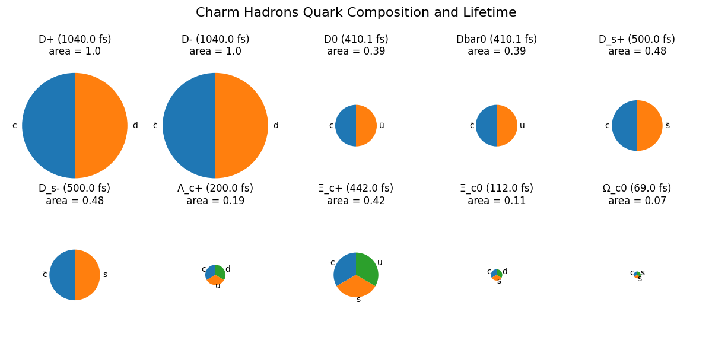

# Charm-Hadrons-Pie-Plots


This Python script visualizes the quark composition and lifetimes of charm hadrons using pie charts. The area of the pie chart is proportional to the lifetime of the hadron.



## Requirements

- Python 3
- Matplotlib (install with `pip install matplotlib`)

## Usage

1. Clone the repository and execute the following code:

   ```bash
   git clone https://github.com/saqlain-khan98/Charm-Hadrons-Pie-Plots
   cd Charm-Hadrons-Pie-Plots
   python3 charm_hadrons.py
   ```
2. A png file named will be saved that will diplay quark compositions of ground-state charm meson and baryons according to quark model.
