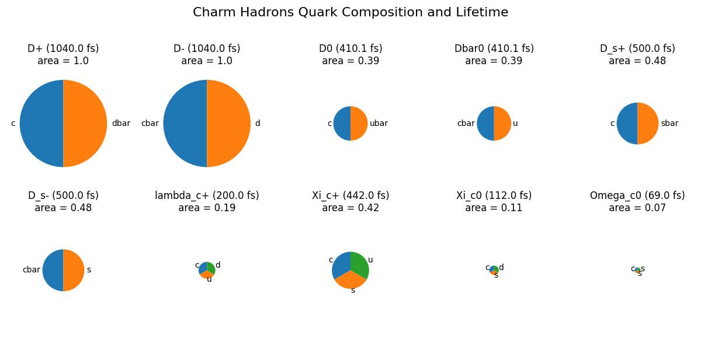

# Charm-Hadrons-Pie-Plots


This Python script visualizes the quark composition and lifetimes of charm hadrons using pie charts. The pie charts are created using the quark percentages as data, and the labels are set to "c," "u," and "d" representing the charm, up, and down quarks, respectively. The colors of the pie charts are not to be confused with the colors of the quarks themselves. The area of the pie chart is proportional to the lifetime of the hadron and is normalized to the largest lifetime for comparison. 



## Installation and Requirements
Make sure to have the following basic requirements installed on your PC:
- Python 3
- Matplotlib (install with `pip install matplotlib`)

Running the code:

1. Clone the repository and execute the following code:

   ```bash
   git clone https://github.com/saqlain-khan98/Charm-Hadrons-Pie-Plots
   cd Charm-Hadrons-Pie-Plots
   python3 charm_hadrons.py
   ```
2. A png file named "charm_hadrons.png" will be saved that will display quark compositions of ground-state charm mesons and baryons according to the quark model (as an example shown above).
